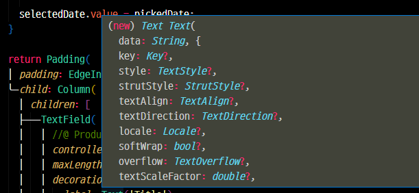

# Dart Tooltip Reformatter

This extension enhances the tooltip provided by the Dart extension in Visual Studio Code. It reformats the parameters to improve readability and make it easier to understand.

## Features

-   Reorders parameters in the hover tooltip, displaying the name first, followed by its type.

## Usage

1. Install this extension alongside the official Dart extension in Visual Studio Code.
2. Hover over a function or method in your Dart code.
3. The hover tooltip will display the reformatted function signature.

## Example

Before using this extension, a typical hover tooltip would look like this:

```dart
void exampleFunction(
    String param1,
    int param2,
    bool? param3
    )
```

After installing this extension, the hover tooltip will be reformatted as:

```dart
void exampleFunction(
    param1: String,
    param2: int,
    param3: bool?
    )
```

## Requirements

Dart extension (dart-code.dart-code)

> https://marketplace.visualstudio.com/items?itemName=Dart-Code.dart-code

## Installation

1. Download and install this extension from the Visual Studio Code marketplace.
2. Ensure that the Dart extension is installed and active.
